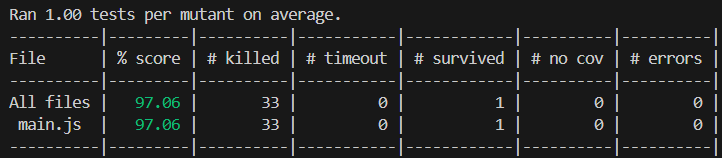
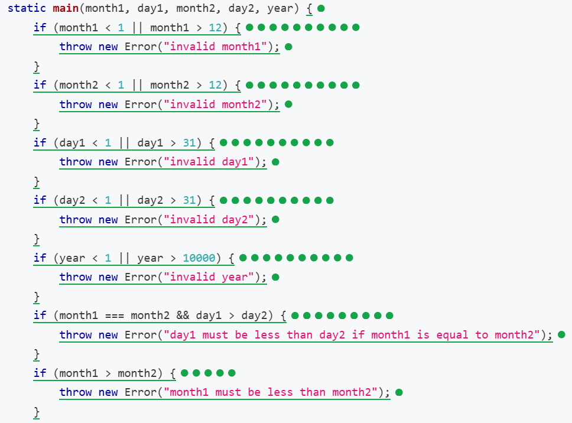
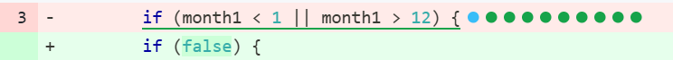
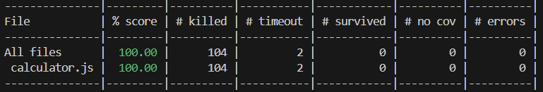

a. How many mutants are there in total? (5%)
106

b. What mutation score were you able to achieve in Lab1’s test suite?



c. How do you kill those mutants? (please paste all of your test code here) 
> 首先可以先透過測試報告來得到所有mutant的位置(如圖中綠點)


> 透過綠點可以得到該mutant的位置與改變的程式為何


> 由此我們便可以設計各個function的unit test來kill掉mutant

1. 首先是關於合法的日月年數字: 要求正確的數字不會throw error，且不正確的數字要assert正確的error name，來避免mutate時輸出錯誤的錯誤資訊，或是正確的case卻產生錯誤。並且在testcase設計時，需要去考慮statement的邊界條件是否會因為binary operator的改變而產生影響。
```
test("Invalid month1", () => {
    assert.throws(()=>{
        Calculator.main(0, 18, 6, 18, 2024)}, new Error("invalid month1"));
    assert.throws(()=>{
        Calculator.main(13, 18, 6, 18, 2024)}, new Error("invalid month1"));

    assert.doesNotThrow(() => {
        const result = Calculator.main(12, 17, 12, 18, 2024);
        assert.strictEqual(result, 1);
    });
});
```
```
test("Invalid month2", () => {
    assert.throws(()=>{
        Calculator.main(6, 17, 0, 18, 2024)}, new Error("invalid month2"));
    assert.throws(()=>{
        Calculator.main(6, 17, 14, 18, 2024)}, new Error("invalid month2"));

    assert.doesNotThrow(() => {
        const result = Calculator.main(1, 17, 1, 18, 2024);
        assert.strictEqual(result, 1);
    });
});
```
```
test("Invalid day1", () => {
    assert.throws(()=>{
        Calculator.main(6, 32, 6, 32, 2024)}, new Error("invalid day1"));
    assert.throws(()=>{
        Calculator.main(6, 0, 6, 18, 2024)}, new Error("invalid day1"));

    assert.doesNotThrow(() => {
        const result = Calculator.main(1, 30, 6, 31, 2024);
        assert.strictEqual(result, 30);
    });
});
```
```
test("Invalid day2", () => {
    assert.throws(()=>{
        Calculator.main(6, 17, 6, 32, 2024)}, new Error("invalid day2"));
    assert.throws(()=>{
        Calculator.main(6, 17, 6, 0, 2024)}, new Error("invalid day2"));

    assert.doesNotThrow(() => {
        const result = Calculator.main(5, 31, 6, 1, 2024);
        assert.strictEqual(result, 1);
    });
});
```
```
test("Invalid year", () => {
    assert.throws(()=>{
        Calculator.main(6, 17, 6, 18, 0)}, new Error("invalid year"));
    assert.throws(()=>{
        Calculator.main(6, 17, 6, 18, 10001)}, new Error("invalid year"));
    assert.doesNotThrow(() => {
        const result = Calculator.main(6, 17, 6, 18, 10000);
        assert.strictEqual(result, 1);
    });
    assert.doesNotThrow(() => {
        const result = Calculator.main(6, 17, 6, 18, 1);
        assert.strictEqual(result, 1);
    });
});
```

2. 第一個日期需要小於等於第二個日期，分成兩個部分:日的比較與年的比較。由於原本的條件式為```day1>day2```會throw error，因此我們僅需要預防day1>day2的case。month同理。
```
test("Day1 should not larger than Day2", () => {
    assert.throws(()=>{
        Calculator.main(6, 18, 6, 17, 2024)},
            new Error("day1 must be less than day2 if month1 is equal to month2"));
    assert.doesNotThrow(() => {
        const result = Calculator.main(6, 17, 6, 17, 2024);
        assert.strictEqual(result, 0);
    });
});

```

```
test("Month1 should not larger than Month2", () => {
    assert.throws(()=>{
        Calculator.main(7, 17, 6, 17, 2024)},
            new Error("month1 must be less than month2"));
    assert.doesNotThrow(() => {
        const result = Calculator.main(6, 17, 6, 17, 2024);
        assert.strictEqual(result, 0);
    });
});
```

3. 閏年的測試需要滿足幾個條件: 能以4整除、能同時以100和400整除。而若是能以100整除，但無法以400整除，則不是閏年。由於main沒有針對超過28的數字throw error，因此以相減的方式來得到天數來檢測。
```
test("Leap years", () => {
    assert.doesNotThrow(() => {
        const result = Calculator.main(2, 29, 3, 1, 2024);
        assert.strictEqual(result, 1);
    });
    assert.doesNotThrow(() => {
        const result = Calculator.main(2, 29, 3, 1, 500);
        assert.strictEqual(result, 0);
    });
    assert.doesNotThrow(() => {
        const result = Calculator.main(2, 29, 3, 1, 400);
        assert.strictEqual(result, 1);
    });
    assert.doesNotThrow(() => {
        const result = Calculator.main(2, 28, 3, 1, 2023);
        assert.strictEqual(result, 1);
    });
});
```

4. 最後進行跨月份的計算，避免for loop之中的statement或是計算式被竄改。
```
    assert.doesNotThrow(() => {
        const result = Calculator.main(6, 18, 8, 18, 2024);
        assert.strictEqual(result, 61);
    });
```

d. What mutation score were you able to achieve? Please paste screenshot of StrykerJS's result



e. Can your test achieve 100% mutation score? Why not if you can't?
在作業中，由於可以根據stryker產生的report來進行unit test的細部改良，並且由於main function的內容很短的緣故。我們的測試程式可以覆蓋到所有的mutant，使其可以在測試階段被kill掉或導致timeout。因此結果上可以達到100% mutation score。


